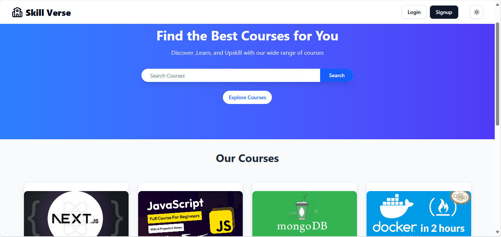
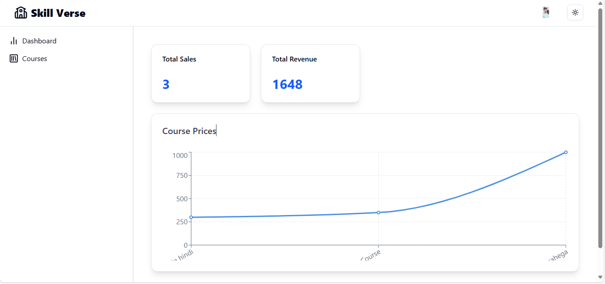
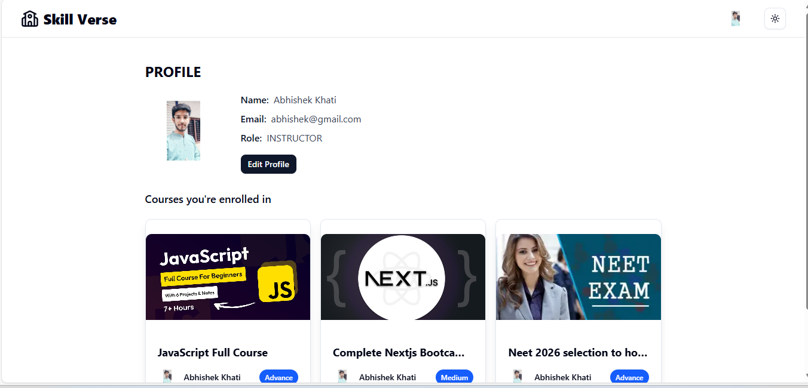

# Skill-Verse: Full-Stack E-Learning Platform

Skill-Verse is a comprehensive, full-stack e-learning platform built with the MERN stack (MongoDB, Express.js, React, Node.js) and integrated with modern tools like Redux Toolkit Query, Tailwind CSS, and Vite. The platform supports distinct roles for students and instructors, featuring secure payments via Cashfree and media management with Cloudinary.

## 🚀 Deployment

You can check out the live app here: [Live Demo](https://skill-verse-front-end-f5pu.vercel.app/)


## 📸 Screenshots

### Homepage


## 📸 Screenshots

### Instructor Dashboard


## 📸 Screenshots

### Edit Profile



## Key Features

| Role/System        | Feature                                                                                              |
| ------------------ | ---------------------------------------------------------------------------------------------------- |
| 🧑‍🎓 **Student**      | Discover and search for courses, filter by category/price, enroll via secure payment, track progress. |
| 👨‍🏫 **Instructor**   | Instructor dashboard, create and manage courses (CRUD), upload and edit lectures, publish/unpublish courses. |
| 🔐 **Authentication** | Secure user registration and login using JSON Web Tokens (JWT) stored in cookies.                   |
| 💳 **Payments**    | Integrated with Cashfree Payment Gateway for seamless course purchases.                                |
| 📊 **Dashboard**   | Instructors can view key metrics like total sales and revenue with graphical data representation.      |
| ⚙️ **Media**         | Efficient video uploads and management handled by Multer and Cloudinary.                             |
| 🌗 **UI & Theme**    | Modern, responsive interface built with Shadcn/ui and Tailwind CSS, featuring a dark/light mode toggle. |

## Tech Stack

| Category         | Technology / Library                                                               |
| ---------------- | ---------------------------------------------------------------------------------- |
| **Frontend**     | React, Vite, Redux Toolkit (RTK Query), React Router, Tailwind CSS, Shadcn/ui, Axios |
| **Backend**      | Node.js, Express.js                                                                |
| **Database**     | MongoDB with Mongoose                                                              |
| **Authentication** | JSON Web Tokens (JWT), bcryptjs                                                   |
| **Payments**     | Cashfree Payment Gateway                                                             |
| **File Storage** | Cloudinary, Multer                                                                   |

## Project Structure

The repository is structured as a monorepo with separate directories for the client and server applications.

```
skill-verse-e-learning-platform/
├── client/       # React (Vite) frontend application
└── server/       # Node.js (Express) backend application
```


## 🎯 Key Features Explained

### 1. Interactive Learning Platform  
Skillverse provides an engaging and user-friendly platform where learners can browse, enroll in, and access courses seamlessly.  
The platform focuses on **structured learning paths**, enabling students to consume content in a logical flow, track their progress, and revisit materials whenever required.  

---

### 2. Secure Authentication & User Management  
User accounts are secured using **JWT (JSON Web Token) authentication**, ensuring that only authorized users can access premium content.  
The platform supports role-based access:
- **Learners** can register, enroll in courses, and track progress.  
- **Instructors/Admins** can upload, manage, and update courses.  

This layered access guarantees both **security and flexibility** for different types of users.  

---

### 3. Course Creation & Management  
Instructors can create courses with details like title, description, price, and content modules (videos, documents, or quizzes).  
The backend allows easy updates and modifications, while learners always see the most updated version of the course.  

This feature ensures Skillverse is not static but evolves with **dynamic course content**.  

---

### 4. Real-time Data Fetching with RTK Query  
Skillverse uses **Redux Toolkit Query (RTK Query)** to handle API calls and cache data efficiently.  
- Learners experience **instant updates** when new content is published.  
- The app minimizes redundant network requests by using cached data when possible.  

This results in a **fast and smooth experience**, even with a large user base.  

---

### 5. Payments & Monetization  
The platform integrates with **Cashfree Payment Gateway**, allowing learners to purchase courses securely using UPI, cards, or wallets.  
- Payments are verified in real-time.  
- The purchase flow updates the learner’s dashboard instantly with newly unlocked courses.  

This ensures a **trustworthy and reliable payment experience** for both learners and instructors.  

---

### 6. Scalable Backend with Node.js & MongoDB  
The backend is built on **Node.js + Express.js**, offering a robust and modular API layer.  
- **MongoDB** serves as the database, handling user data, course content, and payment records.  
- APIs are designed with scalability in mind, so the platform can grow to support thousands of learners and instructors.  

This ensures **long-term reliability and growth**.  

---

### 7. Modern UI & Accessibility  
Skillverse’s frontend is styled with **Tailwind CSS** and **Shadcn/UI**, ensuring:  
- A clean, minimal, and modern look.  
- Responsive design for mobile, tablet, and desktop.  
- Accessibility features like keyboard navigation and ARIA roles for inclusive learning.  

The interface is optimized for **learner engagement and retention**.  

---

### 8. Performance & Optimization  
The platform is engineered for performance:  
- Efficient API calls reduce server load.  
- Lazy loading ensures faster page rendering.  
- Caching with RTK Query reduces unnecessary network requests.  

As a result, learners experience **fast load times and smooth navigation**, even during peak usage.  

---

## 🚀 Getting Started

### Prerequisites

- [Node.js](https://nodejs.org/en) (v18 or higher)
- [MongoDB](https://www.mongodb.com/try/download/community) (local or a cloud instance like MongoDB Atlas)
- [Cloudinary](https://cloudinary.com/) account for media storage
- [Cashfree](https://www.cashfree.com/) account for payment processing

### Installation

1.  **Clone the repository:**
    ```bash
    git clone https://github.com/abhishekkhati-qmf/Skill-Verse-E-Learning-Platform.git
    cd Skill-Verse-E-Learning-Platform
    ```

2.  **Set up the Backend:**
    ```bash
    # Navigate to the server directory
    cd server

    # Install dependencies
    npm install

    # Create a .env file and add your environment variables (see below)
    touch .env 

    # Start the development server
    npm run dev
    ```

3.  **Set up the Frontend:**
    ```bash
    # Navigate to the client directory from the root folder
    cd client

    # Install dependencies
    npm install

    # Start the development server
    npm run dev
    ```
    The client will be running on `http://localhost:5173` and the server on `http://localhost:8080`.

### Environment Variables

Create a `.env` file in the `server` directory and add the following variables:

```env
# Server Configuration
PORT=8080
MONGO_URI=your_mongodb_connection_string

# JWT Configuration
SECRET_KEY=your_super_secret_jwt_key

# Cloudinary Credentials
CLOUD_NAME=your_cloudinary_cloud_name
API_KEY=your_cloudinary_api_key
API_SECRET=your_cloudinary_api_secret

# Cashfree Payments Credentials (use sandbox keys for development)
APP_ID=your_cashfree_app_id
CASHFREE_SECRET_KEY=your_cashfree_secret_key ```

## 🚀 Deployment

### Vercel (Recommended)
1. Connect your GitHub repository to Vercel
2. Set environment variables in Vercel dashboard
3. Deploy automatically on push to main branch

## 🤝 Contributing

1. Fork the repository
2. Create a feature branch (`git checkout -b feature/amazing-feature`)
3. Commit your changes (`git commit -m 'Add some amazing feature'`)
4. Push to the branch (`git push origin feature/amazing-feature`)
5. Open a Pull Request

## 🆘 Support

For support, email abhishekkhati0309@gmail.com .

## 🙏 Acknowledgments

- [React](https://react.dev/) – Frontend library for building user interfaces  
- [Redux Toolkit Query](https://redux-toolkit.js.org/rtk-query/overview) – State management and data fetching  
- [Node.js](https://nodejs.org/) – Backend runtime environment  
- [Express.js](https://expressjs.com/) – Web application framework for Node.js  
- [MongoDB](https://www.mongodb.com/) – NoSQL database  
- [Cashfree](https://www.cashfree.com/) – Payment gateway integration  
- [Tailwind CSS](https://tailwindcss.com/) – Utility-first CSS framework  
- [Shadcn/UI](https://ui.shadcn.com/) – Reusable UI components

---
